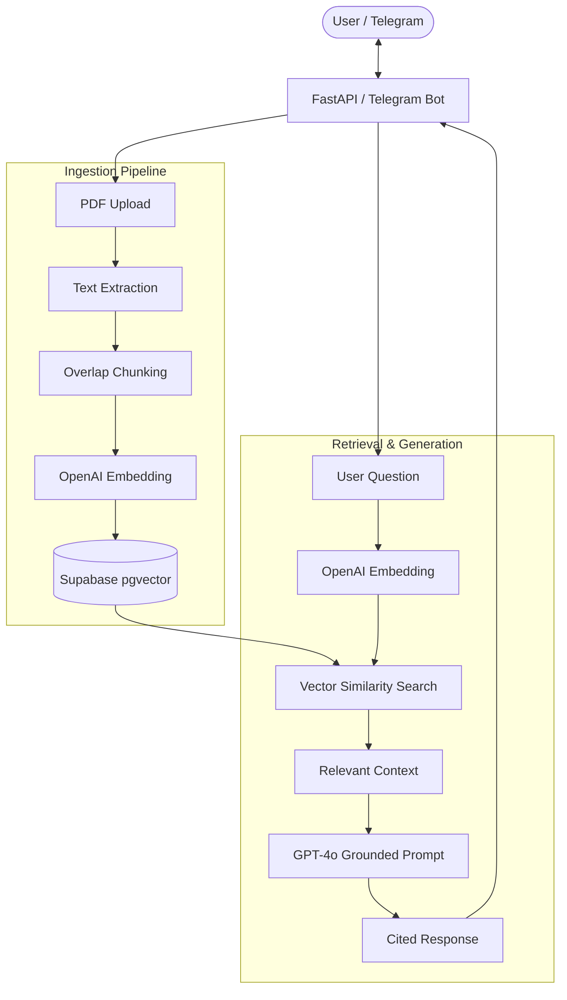

# Autonomous Document Agent

**The problem:** Organizations sit on thousands of internal documents — policies, SOPs, contracts, knowledge bases — but have no reliable way to query them. Staff paste fragments into ChatGPT, get hallucinated answers with zero traceability, and make decisions on unverified information. For regulated industries (legal, finance, healthcare), this is not an inconvenience. It is a compliance risk.

**The solution I built:** A production-grade Retrieval-Augmented Generation (RAG) API that ingests PDF documents into a vector database, retrieves only the relevant fragments for any question, and generates answers that are strictly grounded in source material — with inline citations pointing back to exact pages. If the answer is not in the documents, the system says so instead of fabricating one.

---

## System Architecture



---

## Architecture Decisions

| Decision | Rationale |
| :--- | :--- |
| **pgvector over Pinecone/Weaviate** | Supabase pgvector runs inside Postgres — no additional vendor, no separate billing, and the same RLS policies that protect relational data also protect vector data. For a system handling private documents, consolidating the security surface matters. |
| **OpenAI embeddings + GPT-4o-mini for generation** | Embedding and generation are decoupled by design. Embeddings use `text-embedding-3-small` for cost-efficiency at scale. Generation uses `gpt-4o-mini` for speed and factual consistency in grounded-context tasks. Either model can be swapped without touching the retrieval pipeline. |
| **Overlapping chunks (50-token overlap)** | Context that falls on a chunk boundary is the most common cause of retrieval failure in RAG systems. Overlapping windows ensure boundary-adjacent information appears in at least two chunks, improving recall without inflating storage cost significantly. |
| **Telegram as the primary interface** | The target users are operations teams and field staff who need answers from their phone, not from a browser. Telegram provides a zero-deployment client: drop a PDF, ask a question, get a cited answer — no frontend build required. |
| **FastAPI REST API as the backbone** | The Telegram bot is one interface. The same ingestion and query logic is exposed as authenticated REST endpoints (`POST /ingest`, `POST /ask`, `GET /health`), making the system embeddable in any workflow — n8n, Zapier, internal dashboards, or custom frontends. |

---

## Technical Stack

| Layer | Technology | Role |
| :--- | :--- | :--- |
| API | FastAPI (Python 3.11) | Request validation, routing, API key authentication, structured logging |
| Embeddings | OpenAI `text-embedding-3-small` | Converts text into 1536-dim vectors for semantic search |
| Vector Storage | Supabase + pgvector | Cosine similarity retrieval via `match_documents` RPC function |
| Generation | OpenAI GPT-4o-mini | Grounded answer synthesis from retrieved context only |
| Interface | Telegram Bot (`python-telegram-bot`) | Mobile-first document upload and conversational Q&A |
| Text Extraction | PyPDF2 | Page-by-page PDF text extraction |
| Tokenization | tiktoken (`cl100k_base`) | Accurate token counting for chunk boundaries |
| Containerization | Docker (`python:3.11-slim`) | Reproducible builds for any deployment target |
| CI/CD | GitHub Actions | Automated test + deploy pipeline on push to `main` |
| Hosting | Railway | Live HTTPS endpoint with environment-based configuration |

---

## Running Locally

**1. Configure environment**
```bash
cp .env.example .env
# Add your OPENAI_API_KEY, SUPABASE_URL, SUPABASE_SERVICE_KEY, TELEGRAM_BOT_TOKEN
```

**2. Initialize vector storage**

Run the provided SQL in your Supabase SQL Editor to enable the `pgvector` extension and create the `match_documents` function.

**3. Install and launch**
```bash
pip install .

# Start the REST API
uvicorn app.main:app --reload

# Start the Telegram bot (separate process)
python -m app.telegram_bot
```

---

## What This Project Demonstrates

This is not a tutorial exercise or a wrapper around an API call. It is a complete production system that addresses a specific business problem — unreliable document querying — with an architecture designed for trust, auditability, and operational deployment.

**Engineering decisions reflected here:**
- Separation of embedding, retrieval, and generation into independently testable services
- Strict grounding rules that eliminate hallucination at the prompt level
- Citation enforcement so every answer is verifiable against source material
- Dual-interface design (REST API + Telegram) from a single service layer
- Environment-based configuration with no hardcoded secrets
- Containerized deployment with CI/CD gating on test passage

---

**Built by Wuraola Mathew Oladayo**
AI Automation Engineer — Building autonomous systems where accuracy is non-negotiable.
